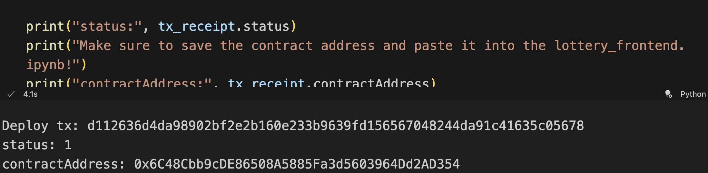
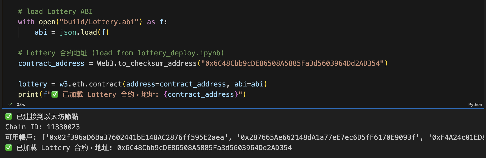
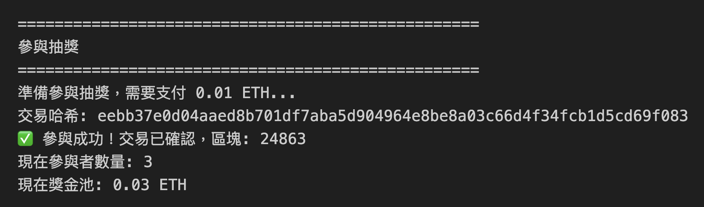
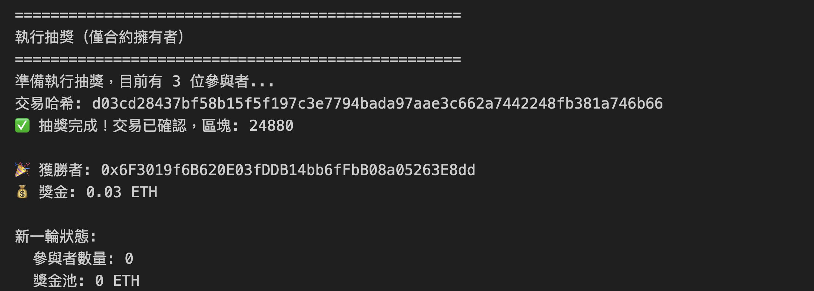
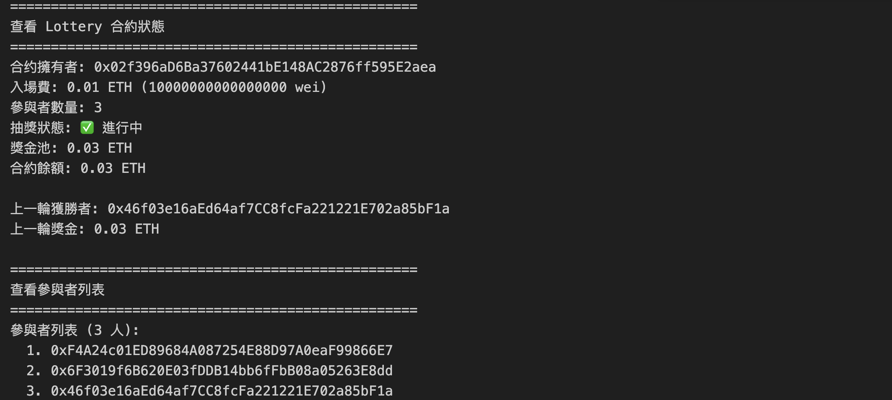

# Group 1 DAPP -- Lottery on Blockchain

## Project Overview

This is a decentralized lottery application (DApp) built on Ethereum blockchain. The project consists of a Solidity smart contract backend and a Python-based frontend interface using Web3.py.

**Project Features:**
- Smart contract-based lottery system with entry fees
- Random winner selection using blockchain randomness
- Prize pool management
- Multiple participant support
- Admin functions for lottery management
- Frontend interface for interaction

**Network Configuration:**
- **Network ID:** 11330023
- **Chain ID:** 11330023
- **RPC Endpoint:** http://127.0.0.1:8545

## Prerequisites

### Network Setup
1. Ensure your blockchain network is running on **Network ID 11330023** and **Chain ID 11330023**
2. The genesis file and prefunded account configuration can be found in `Chain-11330023.zip` (Chapter 7 attachment)

### Prefunded Account
- **Address:** `0x02f396ad6ba37602441be148ac2876ff595e2aea`
- **Password:** `nycu`
- **Note:** This account is shared by all students. Please do not transfer large amounts (e.g., 100 ETH or more) away from this account. The account will be periodically refilled if balance drops below 300 ETH.

### Creating Your Own Accounts
You can create your own accounts and transfer funds from the prefunded account:
```javascript
// In geth console
personal.newAccount("your_password")
// Transfer funds from prefunded account
eth.sendTransaction({from: eth.accounts[0], to: "your_new_account", value: web3.toWei(1, "ether")})
```

### Mining Information
- There are two miners on this network that mine on demand
- You can mine on your computer, but please do not let it mine for long periods as it will raise network difficulty and slow everyone down

## Project Structure

```
lottery/
├── lottery.sol              # Solidity smart contract code
├── lottery_deploy.ipynb    # Jupyter notebook for deploying the contract
├── lottery_frontend.ipynb  # Jupyter notebook for frontend interaction
├── contract_address.txt    # Deployed contract address
└── build/
    ├── Lottery.abi         # Contract ABI (generated)
    └── Lottery.bin         # Contract bytecode (generated)
```

## Installation & Setup Steps

### Step 1: Compile the Smart Contract

Place `lottery.sol` in the `lottery` folder and compile it:

```bash
cd lottery
solc --bin --abi --evm-version=london lottery.sol -o build
```

This will generate:
- `build/Lottery.abi` - Application Binary Interface
- `build/Lottery.bin` - Compiled bytecode

### Step 2: Start Your Blockchain Network

Ensure your geth node is running and connected to Network ID 11330023:

```bash
# Activate your chain (example)
./Chain-11330023/activate_chain.sh
```

Verify connection:
```python
from web3 import Web3
w3 = Web3(Web3.HTTPProvider("http://127.0.0.1:8545"))
assert w3.is_connected()
assert w3.eth.chain_id == 11330023  # Verify Chain ID
```

### Step 3: Unlock the Prefunded Account

In geth console, unlock the prefunded account:

```javascript
personal.unlockAccount(eth.accounts[0], "nycu", 0)
```

### Step 4: Deploy the Contract

Open `lottery_deploy.ipynb` and run all cells. The notebook will:
1. Connect to the blockchain
2. Load the compiled contract (ABI and bytecode)
3. Deploy the contract using the prefunded account (which becomes the contract owner)
4. Display the contract address

**Important:** Save the contract address from the output. You'll need it for the frontend.

Example output:
```
contractAddress: 0x6C48Cbb9cDE86508A5885Fa3d5603964Dd2AD354
```



### Step 5: Set Up Frontend

1. Open `lottery_frontend.ipynb`
2. Update the `contract_address` variable with the address from Step 4:
   ```python
   contract_address = Web3.to_checksum_address("YOUR_CONTRACT_ADDRESS_HERE")
   ```



### Step 6: Create User Accounts (Optional)

To simulate multiple lottery participants, create additional accounts:

```javascript
// In geth console
personal.newAccount("user1")
personal.newAccount("user2")
personal.newAccount("user3")

// Unlock accounts
personal.unlockAccount(eth.accounts[1], "user1", 600)
personal.unlockAccount(eth.accounts[2], "user2", 600)
personal.unlockAccount(eth.accounts[3], "user3", 600)

// Transfer funds from prefunded account (use reasonable amounts, e.g., 1-5 ETH)
eth.sendTransaction({from: eth.accounts[0], to: eth.accounts[1], value: web3.toWei(1, "ether")})
eth.sendTransaction({from: eth.accounts[0], to: eth.accounts[2], value: web3.toWei(1, "ether")})
eth.sendTransaction({from: eth.accounts[0], to: eth.accounts[3], value: web3.toWei(1, "ether")})
```

### Step 7: Interact with the Lottery DApp

Run `lottery_frontend.ipynb` to:
- Check account balances
- View lottery status (entry fee, participants, prize pool)
- Participate in the lottery
- Draw lottery (owner only)
- Manage lottery settings (owner only)





## Smart Contract Features

### User Functions
- `enter()` - Pay entry fee to join the lottery
- `getParticipantCount()` - View number of participants
- `getParticipants()` - View list of all participants
- `getContractBalance()` - View contract balance

### Owner Functions
- `drawLottery()` - Randomly select winner and distribute prize
- `setLotteryActive(bool)` - Pause/resume lottery
- `setEntryFee(uint256)` - Change entry fee (when no participants)
- `manualReset()` - Manually reset lottery and refund participants
- `emergencyWithdraw()` - Emergency withdrawal (owner only)

### Events
- `ParticipantJoined` - Emitted when someone joins
- `LotteryDrawn` - Emitted when lottery is drawn
- `LotteryReset` - Emitted when lottery is reset

## Important Notes

1. **Network Requirements:** The contract must be deployed on Network ID 11330023 and Chain ID 11330023
2. **Account Management:** Use the prefunded account responsibly. Do not transfer large amounts away.
3. **Mining:** The network has on-demand miners. Avoid long-term mining on your machine.
4. **Gas Fees:** Ensure accounts have sufficient balance for transaction fees
5. **Account Unlocking:** Remember to unlock accounts in geth console before transactions

## Submission Deadline

**Last Date for Submission: December 31**

If you need an extension, please email the instructor with justification.

## Contribution

- **113550084** - Implement lottery smart contract lottery.sol
- **111511198** - Project idea, lottery.sol smart contract development, lottery_deploy.ipynb deployment script, lottery_frontend.ipynb frontend interface
- **112550026** - Fixed lottery contract bugs, implement contract testing and integration testing
- **314581040** - Testing lottery contract code and implement frontend-backend integration
- **114511807** - Code testing and blockchain interaction testing
